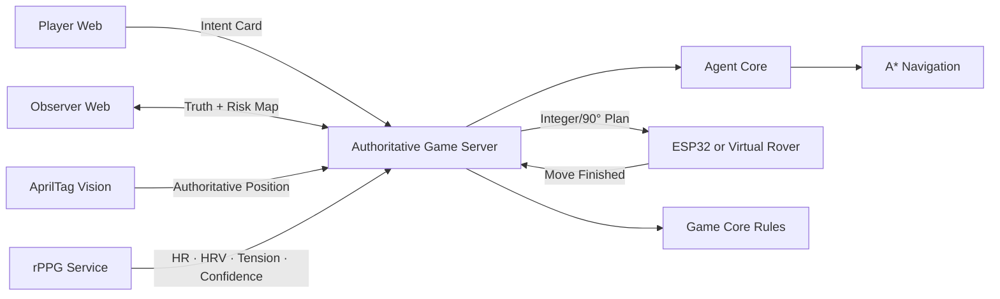

# Jungle Explorer

**实体机器人桌游 × 丛林扫雷推理 × Human-Agent 协作 × 生理感知**

Jungle Explorer 是一款 2–6 人、单局 15–25 分钟的协作探索游戏。玩家不能直接指定小车坐标或方向，只能打出“谨慎、探索、验证、寻找线索”等意图卡；Agent 结合扫雷约束、危险概率、路径收益和团队紧张度自主选择行动。顶置摄像头对实体车的最终格子位置拥有裁判权。

本仓库提供一个可运行、可测试、可逐步接入真实硬件的 Monorepo 框架。默认使用虚拟小车，因此不接摄像头和 ESP32 也可以完成完整回合。

## 当前可用能力

- 5×8 确定性种子地图，隐藏危险、资源、2 个遗迹标记和 2 个遗迹；
- 权威 Game Server，严格分离服务器真相、玩家知识和 Observer Mode；
- 扫雷式八邻域数字提示、3 HP、资源、遗迹夺取与返回 BASE 胜负判定；
- Jungle Awakens：夺取后计时以 1.8 倍流逝、部分安全格重回未知、新增动态危险、Agent 切换撤离策略；
- 风险图推理、A* 路径规划、人格权重和四类意图卡策略；
- 整数格移动及 90° 转弯任务序列；
- 虚拟车自动闭环，以及等待 AprilTag 定位裁决的硬件模式；
- 玩家控制台、Observer 上帝视角、Rover/Agent/Bio HUD 和事件日志；
- Vision、rPPG、ESP32 固件边界、硬件 BOM 与自动化测试骨架。

> rPPG 只提供游戏情境输入，不是医疗测量，也不会直接改变胜负。

## 快速开始

要求 Node.js 22+。

```bash
npm install
npm run dev:server
```

再打开两个终端：

```bash
npm run dev:player
npm run dev:observer
```

- 玩家端：[http://localhost:5173](http://localhost:5173)
- 观察者端：[http://localhost:5174](http://localhost:5174)
- Server 健康检查：[http://localhost:3000/health](http://localhost:3000/health)

默认 `ROVER_MODE=virtual`，Agent 计划会立即由虚拟车完成并回传定位。接入实体车时：

```bash
cp .env.example .env
ROVER_MODE=hardware npm run dev:server
```

此时行动计划会停留在 `DISPATCHED`，只有 `POST /api/games/:id/localizations` 的摄像头定位才能推进回合。置信度低于 0.60 的定位会被拒绝。

## 游戏目标

正式规则提供两种开局前选择的模式：

1. **标准模式**：找到地图中 2 个遗迹的任意 1 个，触发 Jungle Awakens，携带遗迹回到起点 BASE，并至少保留 1 HP；
2. **短模式**：找到并取得任意 1 个遗迹时立即胜利，用于时间有限或撤离效果尚不稳定的演示。

HP 归零、20 分钟耗尽，或遗迹掉落后无法恢复都会失败。运动途中经过的格子不结算，只有 Rover SDK 在运动结束后返回的最终格有效。完整且权威的规则见 [正式规则书](docs/GAME_RULES.md)。

每轮固定为：

```text
观察 → 玩家讨论 → 打出意图卡 → Agent 决策 → 小车行动
    → 摄像头裁决位置 → 揭示格子 → 更新地图
```

四类意图卡：

| 卡牌 | 可选范围 | Agent 倾向 |
| --- | --- | --- |
| `CAUTIOUS` | 当前格周围八格 | 低风险、已知路径优先 |
| `EXPLORE` | 扩展到外侧一层 | 信息收益优先，接受中高风险 |
| `VERIFY` | 前后左右一格 | 小范围正交试探 |
| `FIND_CLUE` | 一条安全的正确提示 | 把提示转化为可执行的一步 |

## 架构



```text
apps/
  game-server/       权威状态、API、硬件/虚拟模式编排
  web-player/        玩家地图、HUD、意图卡
  web-observer/      真相地图、危险概率、调试视角
packages/
  shared-types/      全系统领域类型
  protocol/          Zod 消息 Schema 与设备协议
  game-core/         纯规则、地图、资源、胜负、计时
  navigation/        A* 与实体车命令转换
  agent-core/        Memory/Solver/Policy 风险决策
  ui-components/     两个 Web 端共享组件
services/
  vision-tracking/   AprilTag 像素到网格的裁判边界
  rppg/              生理信号的置信度门控边界
simulations/
  virtual-rover/     与真实车使用同一任务语义
firmware/            早期接口骨架；当前固件由独立 Rover SDK 仓库维护
hardware/            BOM、安全与集成说明
configs/             游戏模式和 Agent 人格参数
docs/                规则、架构与协议细节
```

核心约束是：**Agent 的目标位置不是事实，运动途中经过的格子也不结算；Moonfall Rover SDK 在停车后返回的最终格才会写入 GameState。** SDK、定位服务和硬件调试界面由独立的 [moonfall-rover-control](https://github.com/Moonfall-Lab/moonfall-rover-control) 仓库维护，接入映射见 [Rover SDK 集成契约](docs/ROVER_SDK_INTEGRATION.md)。

## API 概览

| 方法 | 路径 | 用途 |
| --- | --- | --- |
| `POST` | `/api/games` | 创建/重置一局 |
| `GET` | `/api/games/current` | 玩家可见状态，不含隐藏真相 |
| `GET` | `/api/games/current/observer` | Observer 真相和 Agent 风险图 |
| `POST` | `/api/games/:id/intents` | 打出一张意图卡并生成计划 |
| `POST` | `/api/games/:id/localizations` | 摄像头提交最终格子位置 |
| `POST` | `/api/games/:id/bio-signals` | 提交置信度门控后的情境信号 |

运行时请求格式由 `packages/protocol` 的 Zod Schema 定义。更完整的消息示例见 [docs/PROTOCOL.md](docs/PROTOCOL.md)。

## 质量检查

```bash
npm run lint
npm run typecheck
npm test
npm run build

# 或一次执行全部检查
npm run check
```

测试覆盖确定性地图、真相隔离、摄像头裁决、置信度门控、Awakening 计时、正确提示、胜利条件、风险图、意图约束、A*、命令转换、虚拟车和 Server API 闭环。

Python 感知服务可独立启动：

```bash
python3 -m venv .venv
source .venv/bin/activate
pip install -r services/vision-tracking/requirements.txt
uvicorn app.main:app --app-dir services/vision-tracking --port 8101
```

rPPG 服务同理，建议使用独立虚拟环境并运行在 `8102`。

## 下一阶段

1. 用实测轮速和转角替换固件中的计时占位值，完成急停链路；
2. 增加相机四角单应性标定、AprilTag 朝向与静止帧置信度融合；
3. 实现经验证的 POS/CHROM rPPG 管线和质量评估，保留明确免责声明；
4. 为多人卡牌加入 RFID/视觉识别适配器，并把物资牌库存纳入状态；
5. 增加持久化与会话鉴权，隔离 Observer 接口；
6. 在规则 Agent 稳定后，再将 LLM 限定在意图理解和叙事生成，不让它成为唯一决策器。

详细设计见 [正式规则书](docs/GAME_RULES.md)、[架构说明](docs/ARCHITECTURE.md)、[Rover SDK 集成契约](docs/ROVER_SDK_INTEGRATION.md)、[设备协议](docs/PROTOCOL.md) 和 [硬件集成](hardware/README.md)。
